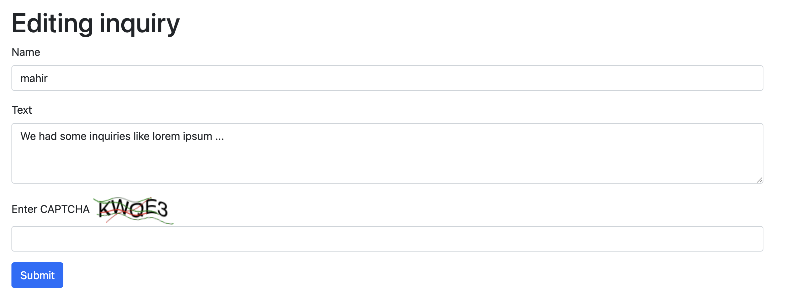

# SimpleCaptchaGuard
A simple light weight captcha guard to guard the bots.



A simple CAPTCHA gem for Rails to prevent bots from submitting forms. And the usage is also so simple.

- ImageMagick needs to be installed in your system

## Usage

Just add `captcha_tag` in your form. It will show you a captcha. Here is a simple code example:
```
  <%= captcha_tag %></br>Enter captcha : 
  <%= text_field_tag :captcha_input %></br></br>
```

and then add `verify_captcha(params[:captcha_input])` in your controller. Here is a sample code example:
```
  # POST /inquiries or /inquiries.json
  def create
    @inquiry = Inquiry.new(inquiry_params)
    if verify_captcha(params[:captcha_input])
      respond_to do |format|
        if @inquiry.save
          format.html { redirect_to @inquiry, notice: "Inquiry was successfully created." }
          format.json { render :show, status: :created, location: @inquiry }
        else
          format.html { render :new, status: :unprocessable_entity }
          format.json { render json: @inquiry.errors, status: :unprocessable_entity }
        end
      end
    else
        flash[:alert] = "CAPTCHA failed. Please try again."
        redirect_to new_inquiry_path
    end
  end
```

Above is a very simple code example. You can use javascript and configure your route and add a method in your controller to implement the feature of `try another captcha`

If you don't want user to lose the data that they already entered into the form, you can implement the captcha before showing the form or handle the captcha failure in a different way.
